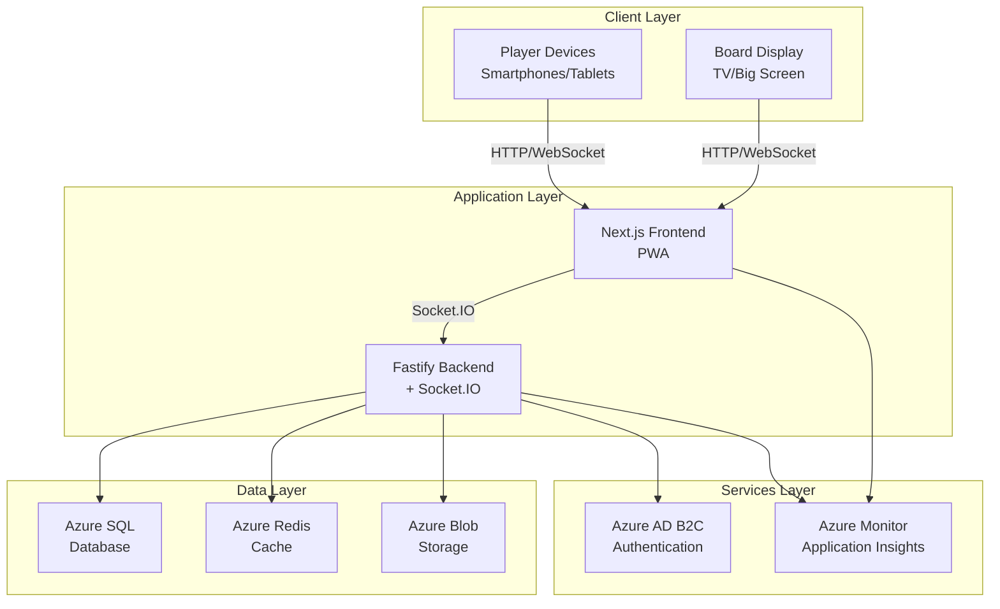
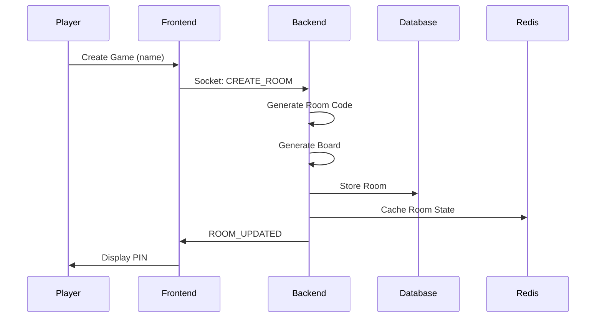
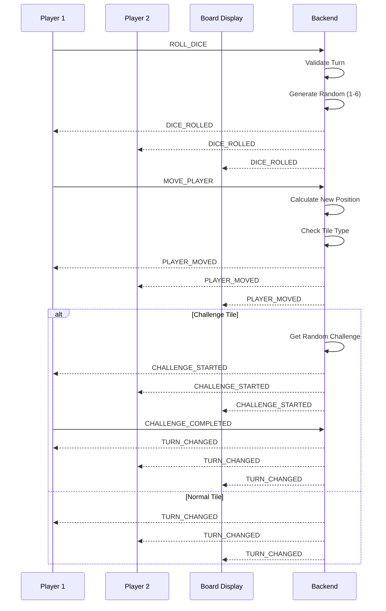
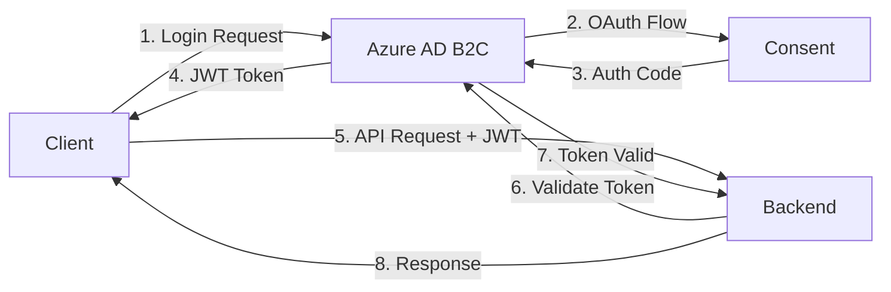

# Architecture Documentation

## System Overview

AlexDrikkelek is a real-time multiplayer board game platform built on a modern client-server architecture with WebSocket communication for real-time gameplay synchronization.

## High-Level Architecture



## Technology Stack

### Frontend Stack

| Technology | Version | Purpose |
|------------|---------|---------|
| Next.js | 14.x | React framework with App Router |
| React | 18.x | UI component library |
| TypeScript | 5.x | Type-safe development |
| Tailwind CSS | 3.x | Utility-first CSS framework |
| Socket.IO Client | 4.x | Real-time WebSocket communication |
| PWA | Latest | Progressive Web App capabilities |

**Frontend Features:**
- Server-Side Rendering (SSR) for initial load
- Client-Side Rendering (CSR) for real-time updates
- Progressive Web App (offline support, installable)
- Responsive design (mobile-first approach)
- Real-time state synchronization

### Backend Stack

| Technology | Version | Purpose |
|------------|---------|---------|
| Node.js | 18.x LTS | JavaScript runtime |
| Fastify | 4.x | High-performance HTTP server |
| Socket.IO | 4.x | WebSocket server |
| TypeScript | 5.x | Type-safe development |
| mssql | Latest | Azure SQL Database client |
| ioredis | Latest | Redis client for caching |

**Backend Features:**
- RESTful API endpoints
- WebSocket server for real-time events
- Server-authoritative game logic (anti-cheat)
- Database connection pooling
- Redis pub/sub for horizontal scaling
- Structured logging

### Azure Services

| Service | Purpose | Environment |
|---------|---------|-------------|
| Azure Static Web Apps | Frontend hosting | Production |
| Azure App Service | Backend hosting | Production |
| Azure SQL Database | Data persistence | Production |
| Azure Cache for Redis | Session storage, caching | Production |
| Azure Blob Storage | Media assets (avatars, icons) | Production |
| Azure AD B2C | User authentication | Production |
| Azure Monitor | Performance monitoring | Production |
| Application Insights | Request tracking, logging | Production |
| Azure DevOps Pipelines | CI/CD automation | All |

## Component Architecture

### Frontend Components

```
packages/frontend/
├── src/
│   ├── app/                    # Next.js App Router
│   │   ├── page.tsx           # Home page (game mode selection)
│   │   ├── layout.tsx         # Root layout with providers
│   │   ├── player/
│   │   │   ├── page.tsx       # Player view entry point
│   │   │   └── PlayerGame.tsx # Player game logic
│   │   └── board/
│   │       ├── page.tsx       # Board view entry point
│   │       └── BoardGame.tsx  # Board display logic
│   │
│   ├── components/            # Reusable React components
│   │   └── ChallengeModal.tsx # Challenge display modal
│   │
│   ├── lib/                   # Utilities and helpers
│   │   └── SocketProvider.tsx # Socket.IO context provider
│   │
│   ├── types/                 # TypeScript type definitions
│   │   └── game.ts           # Game-related types
│   │
│   └── styles/               # Global styles
│       └── globals.css       # Tailwind CSS + custom styles
│
└── public/                   # Static assets
    ├── icons/               # PWA icons
    └── images/             # Game assets
```

### Backend Services

```
packages/backend/
├── src/
│   ├── index.ts              # Application entry point
│   │
│   ├── config/               # Configuration
│   │   ├── database.ts       # Database connection
│   │   ├── redis.ts          # Redis connection
│   │   └── env.ts           # Environment variables
│   │
│   ├── models/               # Data models
│   │   ├── Player.ts         # Player entity
│   │   ├── GameRoom.ts       # Game room entity
│   │   └── Challenge.ts      # Challenge entity
│   │
│   ├── services/             # Business logic
│   │   ├── gameService.ts    # Game logic (dice, movement, turns)
│   │   ├── challengeService.ts # Challenge management
│   │   ├── roomService.ts    # Room management
│   │   └── boardService.ts   # Board generation
│   │
│   └── utils/                # Utilities
│       ├── logger.ts         # Logging utility
│       └── validators.ts     # Input validation
│
└── tests/                    # Test files
    ├── gameService.test.ts
    └── challengeService.test.ts
```

## Data Flow Architecture

### Game Creation Flow



### Gameplay Flow



## Database Schema

### Core Tables

**Players Table**
```sql
CREATE TABLE Players (
    id UNIQUEIDENTIFIER PRIMARY KEY DEFAULT NEWID(),
    name NVARCHAR(100) NOT NULL,
    created_at DATETIME2 DEFAULT GETUTCDATE(),
    last_active DATETIME2 DEFAULT GETUTCDATE()
);
```

**GameRooms Table**
```sql
CREATE TABLE GameRooms (
    id UNIQUEIDENTIFIER PRIMARY KEY DEFAULT NEWID(),
    code NVARCHAR(6) UNIQUE NOT NULL,
    host_id UNIQUEIDENTIFIER FOREIGN KEY REFERENCES Players(id),
    status NVARCHAR(20) NOT NULL, -- 'waiting', 'active', 'finished'
    max_players INT DEFAULT 10,
    board_seed INT NOT NULL,
    created_at DATETIME2 DEFAULT GETUTCDATE(),
    started_at DATETIME2,
    finished_at DATETIME2
);
```

**RoomPlayers Table**
```sql
CREATE TABLE RoomPlayers (
    id UNIQUEIDENTIFIER PRIMARY KEY DEFAULT NEWID(),
    room_id UNIQUEIDENTIFIER FOREIGN KEY REFERENCES GameRooms(id),
    player_id UNIQUEIDENTIFIER FOREIGN KEY REFERENCES Players(id),
    position INT DEFAULT 0,
    turn_order INT NOT NULL,
    joined_at DATETIME2 DEFAULT GETUTCDATE()
);
```

**Challenges Table**
```sql
CREATE TABLE Challenges (
    id UNIQUEIDENTIFIER PRIMARY KEY DEFAULT NEWID(),
    type NVARCHAR(20) NOT NULL, -- 'trivia', 'action', 'dare', 'drinking'
    category NVARCHAR(50),
    question NVARCHAR(500) NOT NULL,
    options NVARCHAR(MAX), -- JSON array for multiple choice
    correct_answer NVARCHAR(200),
    age_rating NVARCHAR(10), -- 'kids', 'teens', 'adults'
    difficulty INT DEFAULT 1, -- 1-5
    created_at DATETIME2 DEFAULT GETUTCDATE()
);
```

For the complete schema, see [`/database/schema.sql`](https://github.com/balburg/AlexDrikkelek/blob/main/database/schema.sql).

## Redis Cache Structure

### Cache Keys

```
room:{roomId}                    # Game room state
room:code:{code}                 # Room ID by code lookup
room:{roomId}:players            # Players in room (SET)
session:{sessionId}              # Player session data
ratelimit:{ip}:{endpoint}        # Rate limiting
leaderboard:daily                # Daily leaderboard (ZSET)
```

### Pub/Sub Channels

```
room:{roomId}:events             # Room-specific events
global:announcements             # Global announcements
```

## API Endpoints

### REST API

Source: [`docs/API.md`](https://github.com/balburg/AlexDrikkelek/blob/main/docs/API.md)

```
GET  /health                     # Health check
GET  /api/ping                   # Connectivity test
POST /api/rooms                  # Create game room
GET  /api/rooms/:id              # Get room details
POST /api/rooms/:id/join         # Join room
GET  /api/challenges/random      # Get random challenge
```

### WebSocket Events

#### Client → Server

```typescript
- create_room: { playerName, maxPlayers }
- join_room: { code, playerName }
- leave_room: { roomId, playerId }
- start_game: { roomId }
- roll_dice: { roomId, playerId }
- move_player: { roomId, playerId, diceRoll }
- challenge_completed: { roomId, playerId, success }
```

#### Server → Client

```typescript
- room_updated: { room: GameRoom }
- game_started: { room: GameRoom }
- dice_rolled: { playerId, playerName, diceRoll }
- player_moved: { playerId, playerName, newPosition, tile }
- challenge_started: { playerId, playerName, tile, challenge }
- challenge_completed: { playerId, playerName, success }
- turn_changed: { currentTurn, currentPlayer }
- game_ended: { winnerId, winnerName, stats }
- error: { message }
```

## Security Architecture

### Authentication & Authorization



**Security Measures:**

1. **Server-Authoritative Logic**
   - All game logic runs on the server
   - Clients cannot manipulate game state directly
   - Dice rolls generated server-side (anti-cheat)

2. **Input Validation**
   - All inputs sanitized and validated
   - TypeScript type checking
   - Schema validation with Joi/Zod

3. **Rate Limiting**
   - API endpoints protected from abuse
   - Redis-based rate limiting
   - Per-IP and per-user limits

4. **HTTPS/WSS**
   - All communication encrypted in production
   - TLS 1.2+ required

5. **CORS Configuration**
   - Whitelist of allowed origins
   - Credentials included only for trusted domains

6. **SQL Injection Prevention**
   - Parameterized queries only
   - ORM/query builder usage

7. **XSS Prevention**
   - React's built-in escaping
   - Content Security Policy headers

## Scalability Design

### Horizontal Scaling

```
┌─────────────┐     ┌─────────────┐     ┌─────────────┐
│  Backend 1  │     │  Backend 2  │     │  Backend 3  │
│  + Socket.IO│     │  + Socket.IO│     │  + Socket.IO│
└──────┬──────┘     └──────┬──────┘     └──────┬──────┘
       │                   │                   │
       └───────────────────┼───────────────────┘
                           │
                    ┌──────▼──────┐
                    │    Redis    │
                    │   Pub/Sub   │
                    └─────────────┘
```

**Scaling Strategies:**

1. **Stateless Backend**
   - Session state in Redis, not memory
   - Any backend instance can handle any request

2. **Redis Adapter for Socket.IO**
   - Synchronizes WebSocket events across instances
   - Pub/sub for cross-instance communication

3. **Database Connection Pooling**
   - Reuse database connections
   - Prevents connection exhaustion

4. **CDN for Static Assets**
   - Azure CDN for frontend assets
   - Reduced backend load

5. **Load Balancing**
   - Azure Load Balancer or Application Gateway
   - Sticky sessions for WebSocket connections

## Monitoring & Observability

### Application Insights Integration

**Tracked Metrics:**
- Request duration and throughput
- Dependency calls (DB, Redis, External APIs)
- Exception tracking and stack traces
- Custom events (game created, game started, challenge completed)
- User sessions and active players

**Custom Logging:**
```typescript
logger.info('Game created', { roomId, playerCount });
logger.warn('Player timeout', { playerId, roomId });
logger.error('Database connection failed', { error });
```

### Performance Monitoring

**Key Performance Indicators (KPIs):**
- API response time (p50, p95, p99)
- WebSocket message latency
- Database query performance
- Cache hit/miss ratio
- Active games and players
- Error rate

## Deployment Architecture

### Production Environment

```
Internet
   │
   ├─→ Azure CDN
   │      ├─→ Static Assets (images, fonts)
   │      └─→ Frontend App (cached)
   │
   ├─→ Azure Static Web Apps
   │      └─→ Next.js Frontend
   │             │
   │             └─→ Socket.IO Client
   │
   └─→ Azure Load Balancer
          └─→ App Service Instances
                 └─→ Fastify Backend + Socket.IO
                        │
                        ├─→ Azure SQL Database
                        ├─→ Azure Redis Cache
                        ├─→ Azure Blob Storage
                        ├─→ Azure AD B2C
                        └─→ Application Insights
```

### CI/CD Pipeline

See [Deployment Guide](./Deployment.md) for detailed deployment instructions.

**Pipeline Stages:**
1. Source: GitHub repository
2. Build: npm install + npm run build
3. Test: npm test
4. Security Scan: npm audit, Snyk
5. Deploy to Staging
6. Integration Tests
7. Deploy to Production
8. Smoke Tests

## Future Enhancements

- [ ] Horizontal scaling with multiple backend instances
- [ ] Machine learning for challenge difficulty adjustment
- [ ] Video chat integration (WebRTC)
- [ ] Tournament mode with brackets
- [ ] Custom board editor
- [ ] Achievement system
- [ ] Replay system with playback
- [ ] Mobile native apps (React Native)
- [ ] Offline mode with local multiplayer

## References

- [API Reference](./API-Reference.md)
- [Deployment Guide](./Deployment.md)
- [Build and Run Guide](./Build-and-Run.md)
- [GitHub Repository](https://github.com/balburg/AlexDrikkelek)

---

**Last updated:** 12-11-2024
