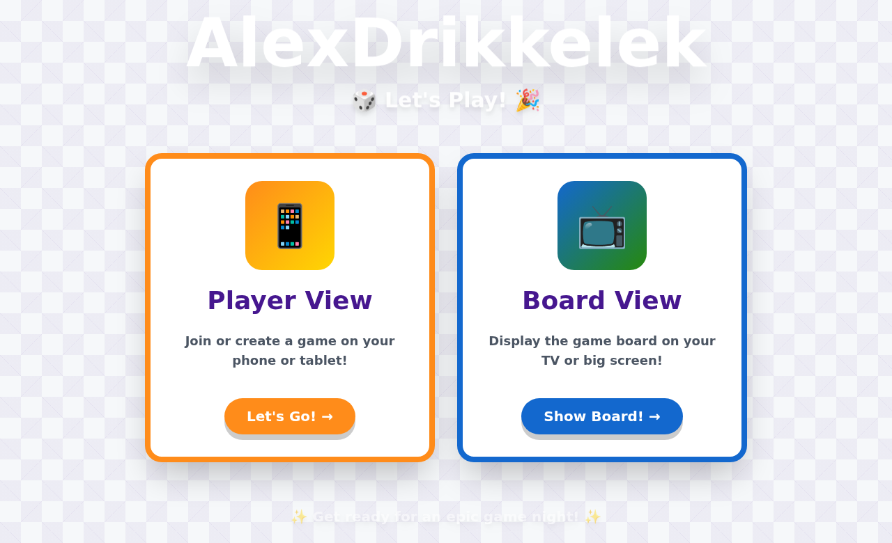
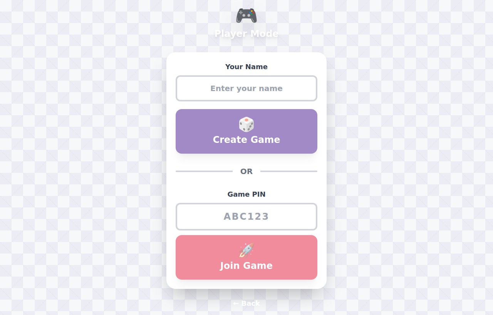
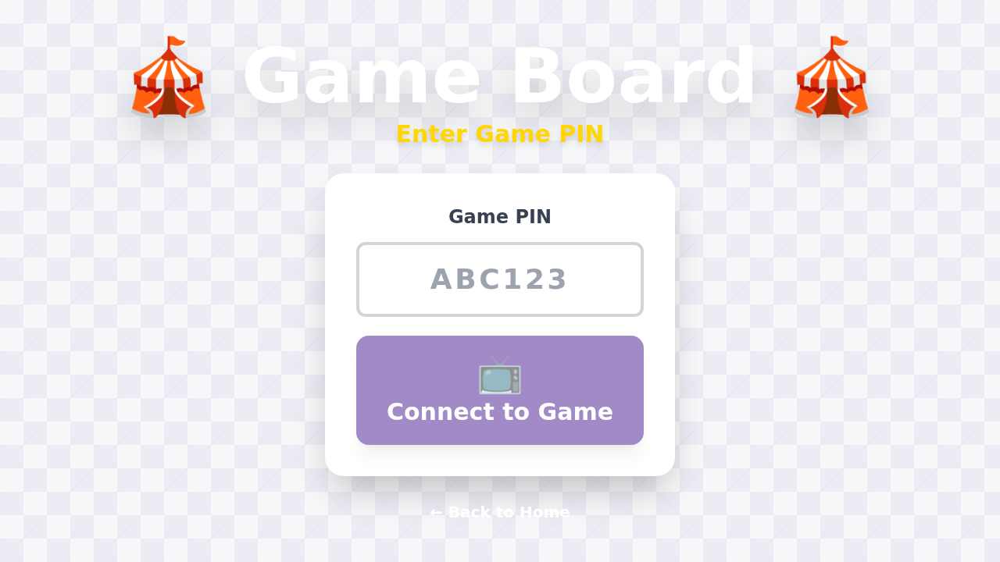

# User Guide - How to Play AlexDrikkelek

This guide walks you through playing AlexDrikkelek, from starting a game to winning the board. Screenshots illustrate each step.

## Table of Contents

1. [Overview](#overview)
2. [Getting Started](#getting-started)
3. [Player View (Mobile/Tablet)](#player-view-mobiletablet)
4. [Board View (TV/Big Screen)](#board-view-tvbig-screen)
5. [Game Flow](#game-flow)
6. [Challenge System](#challenge-system)
7. [Winning the Game](#winning-the-game)
8. [Tips and Tricks](#tips-and-tricks)

## Overview

AlexDrikkelek is a multiplayer board game designed for cross-device play:

- **2-10 Players**: Each player uses their smartphone or tablet
- **Shared Board**: Display the game board on a TV or large screen
- **Real-time Sync**: All devices stay synchronized throughout the game
- **Dynamic Challenges**: Random challenges appear when landing on special tiles

### Game Components

- **Player Devices**: Control your game piece, roll dice, complete challenges
- **Board Display**: Shows the game board, player positions, and current actions
- **Game PIN**: 6-character code used to connect all devices to the same game

## Getting Started

### Step 1: Access the Game

Open your web browser and navigate to the AlexDrikkelek application (e.g., http://localhost:3000 for local development or your deployed URL).

You'll see the home page with two options:



**Home Page Features:**
- **Player View** button - For players joining with their mobile devices
- **Board View** button - For displaying the game board on a TV/screen

### Step 2: Choose Your Role

**Are you a player?**
- Tap **"Player View"** on your smartphone or tablet

**Setting up the board display?**
- Select **"Board View"** on the TV or big screen

## Player View (Mobile/Tablet)

### Accessing Player Mode

Click or tap on **"Player View"** from the home page. You'll see the player interface:



### Creating a New Game

**Steps to Create a Game:**

1. **Enter Your Name**
   - Type your name in the "Your Name" text field
   - This will be your display name throughout the game

2. **Click "Create Game"**
   - Once you've entered your name, the button becomes active
   - Click the 🎲 **"Create Game"** button

3. **Receive Game PIN**
   - The system generates a unique 6-character PIN (e.g., "ABC123")
   - Share this PIN with other players so they can join
   - The game board will also need this PIN to connect

4. **Wait for Players**
   - As players join, you'll see them appear on your screen
   - Minimum 2 players required to start
   - Maximum 10 players supported

5. **Start the Game**
   - When ready, the host can start the game
   - All connected devices will be notified

### Joining an Existing Game

**Steps to Join a Game:**

1. **Enter Your Name**
   - Type your name in the "Your Name" field

2. **Enter Game PIN**
   - Ask the game host for the 6-character PIN
   - Type it in the "Game PIN" field (e.g., "ABC123")

3. **Click "Join Game"**
   - Click the 🚀 **"Join Game"** button
   - You'll be connected to the game room
   - Other players will see you join

### Player Controls During the Game

Once the game has started, you'll see:

**Your Information:**
- Your name and avatar
- Current position on the board
- Whether it's your turn

**Game Actions:**
- **Roll Dice** button (when it's your turn)
- **Complete Challenge** button (when you land on a challenge tile)
- Current game status and messages

**Turn Sequence:**
1. Wait for your turn (indicated by your name highlighted)
2. Roll the dice by clicking the 🎲 button
3. Watch your piece move automatically
4. Complete any challenges if you land on a special tile
5. Wait for other players to take their turns

## Board View (TV/Big Screen)

### Accessing Board Mode

Click or tap on **"Board View"** from the home page on your TV or large screen:



### Connecting the Board to a Game

**Steps to Connect:**

1. **Enter Game PIN**
   - Get the PIN from the player who created the game
   - Type it in the "Game PIN" field

2. **Click "Connect to Game"**
   - Click the 📺 **"Connect to Game"** button
   - The board will load and display the game

3. **Board Display**
   - Shows the complete game board with all tiles
   - Displays all player pieces at their current positions
   - Shows whose turn it is
   - Displays dice rolls in real-time
   - Shows challenge information when they occur

### What the Board Shows

**Game Board Elements:**
- **Start Tile**: Where all players begin (position 0)
- **Normal Tiles**: Regular spaces that just advance your position
- **Challenge Tiles**: Trigger trivia or action challenges
- **Bonus Tiles**: Positive challenges with rewards
- **Penalty Tiles**: Challenges that may set you back
- **Finish Tile**: The goal - first player to reach it wins!

**Player Information:**
- Player name and avatar color
- Current position on the board
- Whose turn it is (highlighted)

**Game Status:**
- Current turn counter
- Last action message
- Real-time dice roll display (shows for 3 seconds)

## Game Flow

### Complete Game Sequence

```
1. Host creates game → Receives PIN
         ↓
2. Players join using PIN
         ↓
3. Board connects using same PIN
         ↓
4. Host starts game
         ↓
5. First player's turn begins
         ↓
6. Player rolls dice
         ↓
7. Dice result shown on all devices
         ↓
8. Player piece moves automatically
         ↓
9. If challenge tile → Show challenge
         ↓
10. Player completes challenge
         ↓
11. Next player's turn
         ↓
12. Repeat until someone reaches finish
         ↓
13. Winner declared! 🎉
```

### Turn-Based Gameplay

**How Turns Work:**
1. Players take turns in the order they joined
2. Only the current player can roll the dice
3. Dice rolls are validated by the server (anti-cheat)
4. Movement is automatic after rolling
5. Turns advance automatically after challenges complete

**Turn Indicators:**
- Your player card highlights when it's your turn
- The board shows whose turn it is
- You receive a notification: "Your turn!"

## Challenge System

### Types of Challenges

AlexDrikkelek features different challenge types based on the tile you land on:

#### 1. Trivia Challenges
- **Multiple choice questions**
- Topics include: general knowledge, science, history, pop culture
- Correct answer = move forward bonus spaces
- Wrong answer = no penalty (or minor setback)

#### 2. Action Challenges
- **Physical activities**
- Examples: "Do 5 jumping jacks", "Hold a plank for 10 seconds"
- Complete the action to proceed
- Other players can verify completion

#### 3. Dare Challenges
- **Social challenges** (for teen/adult games)
- Fun dares that get everyone laughing
- Self-reported completion

#### 4. Drinking Challenges
- **Party game mode** (for adult games only)
- Drinking-related challenges
- Age-appropriate content filtering

### Challenge Difficulty

Challenges are categorized by age group:
- **Kids (6+)**: Simple, fun, age-appropriate
- **Teens (13+)**: More challenging questions and actions
- **Adults (18+)**: Advanced difficulty, includes party content

### Completing Challenges

**When you land on a challenge tile:**

1. **Challenge Modal Appears**
   - Shows the challenge text
   - Displays any multiple-choice options (for trivia)
   - Countdown timer may appear

2. **Complete the Challenge**
   - Answer the trivia question, or
   - Perform the action, or
   - Complete the dare

3. **Submit Your Response**
   - Click the answer button (for trivia)
   - Click "Done" when finished (for actions)

4. **Receive Feedback**
   - Correct answers show success message
   - May receive bonus points or extra moves
   - Game automatically advances to next turn

## Winning the Game

### Victory Conditions

**Primary Goal:** Be the first player to reach the **Finish** tile

**How to Win:**
1. Navigate the board by rolling dice
2. Complete challenges to avoid setbacks
3. Use bonus tiles to gain advantages
4. Reach the finish line first!

**When Someone Wins:**
- 🎉 Victory animation displays
- Winner's name announced on all devices
- Game statistics shown (moves taken, challenges completed)
- Option to play again with the same players

### Point System (Future Feature)

While the current version focuses on racing to the finish, future updates may include:
- Points for correct challenge answers
- Bonus points for consecutive correct answers
- Leaderboard for multi-game tournaments

## Tips and Tricks

### For Players

1. **Stay Connected**: Keep your device active and connected to WiFi
2. **Quick Reflexes**: Some challenges have time limits
3. **Strategic Thinking**: Plan your moves based on upcoming tiles
4. **Team Spirit**: Encourage and cheer for other players!

### For the Host

1. **Share the PIN Clearly**: Write it down or display it prominently
2. **Wait for Everyone**: Ensure all players have joined before starting
3. **Set the Mood**: Use the TV display to create an immersive experience
4. **Test Connection**: Do a quick test before the actual game night

### For the Board Display

1. **Screen Size**: Use the largest screen available for best experience
2. **Brightness**: Adjust screen brightness for comfortable viewing
3. **Sound**: Enable audio for notifications and effects
4. **Positioning**: Make sure everyone can see the screen clearly

### Technical Tips

1. **Stable Internet**: Use WiFi over cellular for best connection
2. **Same Network**: All devices should be on the same WiFi network if possible
3. **Modern Browser**: Use Chrome, Firefox, Safari, or Edge (latest versions)
4. **PWA Install**: Install as a Progressive Web App for offline capabilities

## Troubleshooting Common Issues

### "Can't Connect to Game"
- Verify the PIN is correct (6 characters, case-sensitive)
- Check that the host has created the game
- Ensure your internet connection is stable

### "Dice Won't Roll"
- Make sure it's your turn
- Check WebSocket connection (should show "Connected")
- Refresh the page and rejoin

### "Challenge Not Appearing"
- Wait a few seconds for synchronization
- Refresh your browser
- Check console for errors (F12 in most browsers)

### "Board Not Updating"
- Verify the board is connected to the correct game PIN
- Refresh the board display
- Check network connection

For more technical troubleshooting, see the [Troubleshooting Guide](./Troubleshooting.md).

## Keyboard Shortcuts (Future Feature)

Current version uses touch/click controls. Future updates may include:
- **Space**: Roll dice (when it's your turn)
- **Enter**: Submit challenge answer
- **Esc**: Close modal
- **Arrow Keys**: Navigate UI

## Accessibility Features

AlexDrikkelek is designed with accessibility in mind:

- **Color-Blind Friendly**: Uses patterns and labels, not just colors
- **Screen Reader Support**: ARIA labels for all interactive elements
- **Keyboard Navigation**: All features accessible via keyboard
- **High Contrast Mode**: Available in settings
- **Text Scaling**: Respects browser/device text size settings

## Multi-Language Support (Future Feature)

Currently in English, with plans to support:
- Spanish
- French
- German
- Dutch
- And more!

## Chromecast Support

### Casting the Board to Your TV

If you have a Chromecast device:

1. Click the Cast icon in your browser (Chrome)
2. Select your Chromecast device
3. Navigate to the board view
4. The game board will display on your TV

## Game Modes (Future Features)

Future updates will include:
- **Quick Play**: Shorter boards for fast games
- **Marathon**: Extra-long boards for extended play
- **Tournament**: Multi-game competitions with rankings
- **Custom Boards**: Create your own board layouts
- **Theme Nights**: Special themed challenges (80s, Movies, Sports, etc.)

## Privacy and Data

AlexDrikkelek respects your privacy:
- **No Personal Data**: Only your chosen name is used
- **No Tracking**: We don't track your gameplay beyond the session
- **Temporary Storage**: Game data deleted after session ends
- **GDPR Compliant**: Meets European privacy standards

For more information, see our Privacy Policy.

---

**Need More Help?**
- [Troubleshooting Guide](./Troubleshooting.md)
- [FAQ Section](./FAQ.md) (Coming Soon)
- [GitHub Issues](https://github.com/balburg/AlexDrikkelek/issues)

**Last updated:** 12-11-2024
